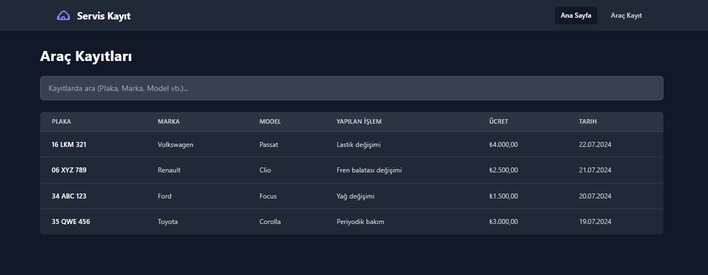
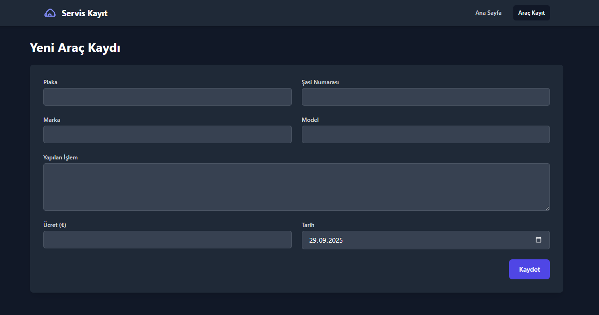

## Example Images

### Homepage

### Vehicle Registration Page

## Run Locally

**Prerequisites:**  Node.js

1. Install dependencies:
   `npm install`
3. Replace `firebaseConfig` in [services/firebaseService.ts](services/firebaseService.ts) file with your own information.
4. Run the app:
   `npm run dev`
